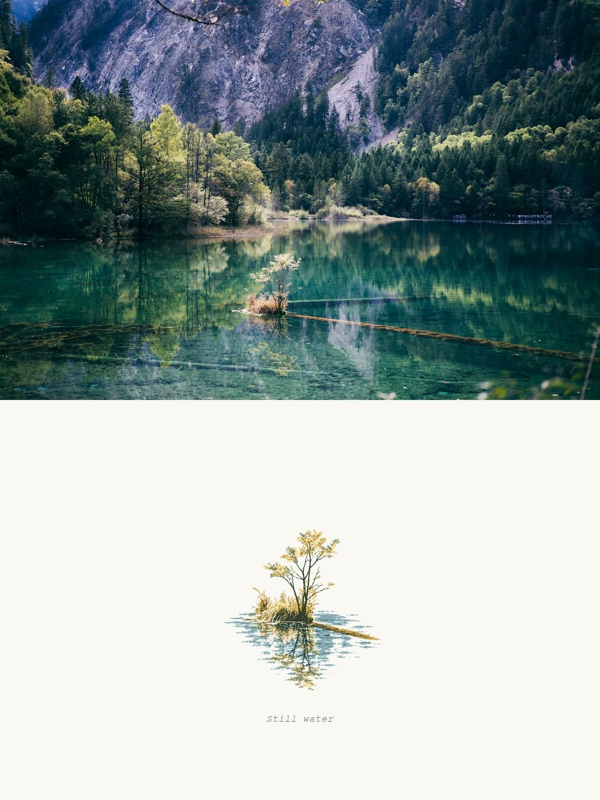
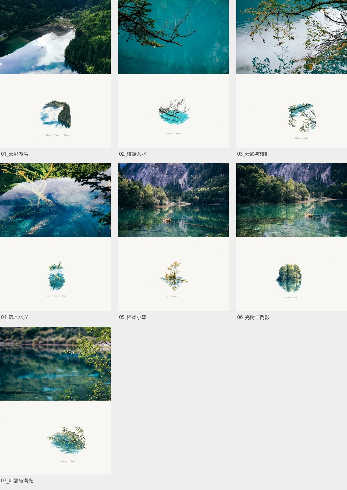
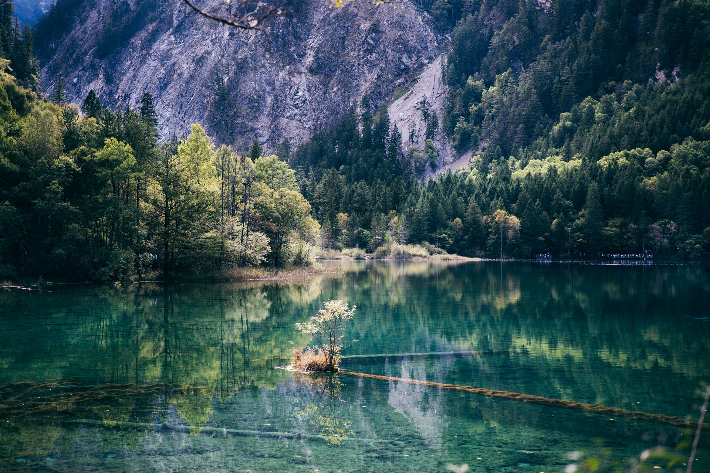
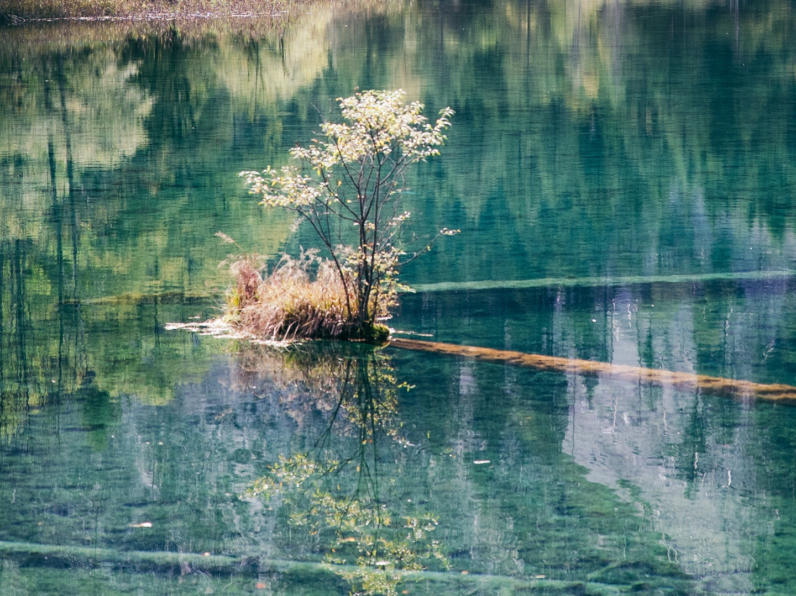
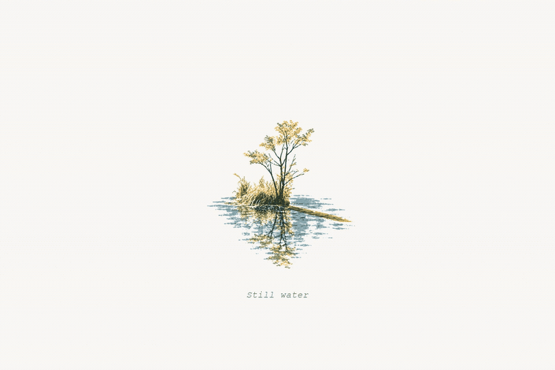
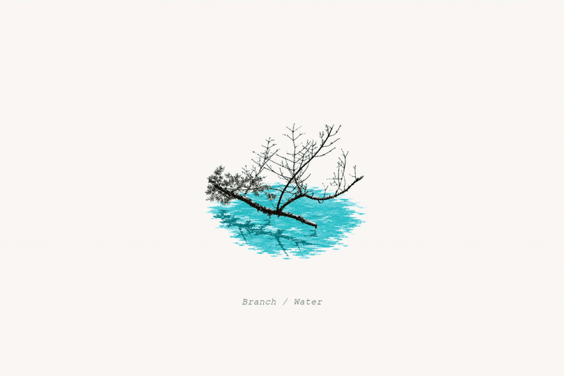
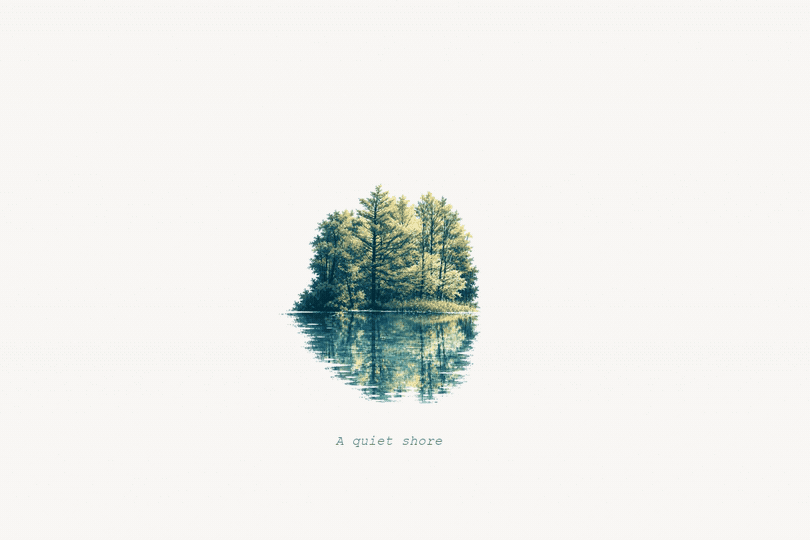

<div align="center">

# Live 照片手帐

**把旅途里有特点的一小块画面，留下来。**

原照片 · 局部小景 · 克制微动

[看效果](#看效果) · [设计方法](#怎样选景怎样排版) · [安装与使用](#安装与使用) · [输出说明](#会得到什么)

</div>

---

一张旅行照片里，最值得记住的可能是湖中的一棵小树、横枝和它的倒影，也可能是一段屋檐与台阶的关系。这个skill先找到那块有辨识度的画面，把它画成精巧的小景，放在原照片下方，再让叶端或水纹轻轻动起来。

照片保留真实观看的分量，插画承担较轻的记忆回应。AI负责取景分析和插画，本机脚本负责拼版、动画与文件导出。

## 看效果

<p align="center">
  
</p>

<p align="center"><em>Still water · 原片在上，小景在下</em></p>

这个例子来自真实的九寨沟旅行照片。插画选择水中的小植物岛、短沉木和紧邻倒影；远岸森林与山壁留在原片中。下方小景约300×302px，整体画布1080×1440，纸面保留大面积空白。

### 七张真实作品

<p align="center">
  
</p>

七张原片各自选择不同的局部关系，没有统一套成同一个小树模板。

| 作品 | 选中的特色画面 | 完整成品 |
| --- | --- | --- |
| 云影湖湾 | 湖湾、云影与相邻林岸的弧线关系 | [封面](assets/examples/01-cloud-bay/cover.jpg) · [MP4](assets/examples/01-cloud-bay/preview.mp4) |
| 枝端入水 | 枝条分叉端与紧邻蓝绿水面 | [封面](assets/examples/02-branch-water/cover.jpg) · [MP4](assets/examples/02-branch-water/preview.mp4) |
| 云影与枝框 | 枝叶框景与水中云影 | [封面](assets/examples/03-cloud-branch/cover.jpg) · [MP4](assets/examples/03-cloud-branch/preview.mp4) |
| 沉木水光 | 水下沉木分叉和水面光痕 | [封面](assets/examples/04-submerged-wood/cover.jpg) · [MP4](assets/examples/04-submerged-wood/preview.mp4) |
| 植物小岛 | 小植物岛、短沉木与紧邻倒影 | [封面](assets/examples/05-island/cover.jpg) · [MP4](assets/examples/05-island/preview.mp4) |
| 亮树与倒影 | 一簇亮树及其直接倒影 | [封面](assets/examples/06-tree-reflection/cover.jpg) · [MP4](assets/examples/06-tree-reflection/preview.mp4) |
| 叶端与湖光 | 叶端、相邻湖光与少量水纹 | [封面](assets/examples/07-leaf-light/cover.jpg) · [MP4](assets/examples/07-leaf-light/preview.mp4) |

也可以看 [七张动态总览](assets/gallery.mp4)。

### 从整张照片，走到实际取景

| 示例输入 | 插画使用的实际局部 |
| :---: | :---: |
|  |  |

取景决定了插画的信息量。保留树根、横枝、水线和倒影，才是一块可以读懂的画面；需要更多环境时，再有理由地扩大。

### 动起来的是局部

<p align="center">
  
</p>

GIF放大展示下半幅，根部左侧水纹与下方倒影各有一个小区域；岸上植物和短沉木保持固定。完整视频里的上半照片、纸面和标题也固定。查看 [完整三秒MP4](assets/examples/05-island/preview.mp4) 或 [制作检查记录](assets/examples/05-island/report.json)。

| 枝端入水 · 局部水纹 | 亮树与倒影 · 局部倒影 |
| :---: | :---: |
|  |  |

> 全部展示来自维护者授权公开的七张真实照片与已确认成品。插画由Luna编排生图工具制作，排版和局部动画在本机完成。此次发布直接复用成品，没有重新生图；公开原片与参考图已缩小并去除EXIF。GIF用于预览，Apple配对检查与手机实测分别记录。

## 怎样选景，怎样排版

### 一块有特点的连续画面

先找主体的特色局部，再补必要的连接关系：树与水线、船与岸、屋檐与台阶、枝条与倒影。没有醒目的主体时，山脊交叠、岸湾转折与云影也可以成为小景核心。

从最小可读范围出发。若关系被截断，或缩小后不能辨认，才逐渐扩大，并保存理由与参考裁片供检查。每张照片独立选择，不套用示例的坐标和对象。

### 照片、插画和留白各有分量

默认画布1080×1440，上半原照片、下半近白纸面各占一半。照片铺满上半，纸面只出现在下半；没有整页米白外框、撕纸边或多余装饰。

插画以细而断续的结构线、少量源图颜色和疏松印刷痕迹形成层次。主锚点更清楚，辅助环境逐渐消失。按可见墨痕控制大小和视觉重心，密实图案进一步缩小。

| 默认设计 | 数值与含义 |
| --- | --- |
| 画布 | 1080×1440，上下各720px |
| 小景尺度 | 初始宽≤43%整幅宽，高≤42%下半高；是上限，不是填满目标 |
| 位置 | 下半视觉重心约55%，横向随主景适度偏置 |
| 色彩 | 两至四种主要源图颜色，细线与空白保留结构 |
| 文字 | 可选单行小标题，不推测日期地点 |
| 动画 | 最多两个局部区域，默认3秒、30fps |

竖照片等比裁入上半窗口，可以调焦点；源文件完整保留。3:2横照片可完整填入默认窗口。用户明确指定比例和构图时，skill沿用该选择。

详细规则见 [比例与审美](references/layout-and-style.md)。

## 安装与使用

### 在Codex里调用

这是一个agent skill，包含提示词和本机制作助手。克隆到Codex的skills目录，保持目录名 `live-photo-handbook`：

**Windows PowerShell**

```powershell
git clone https://github.com/Michaeloan/live-photo-handbook-skill.git "$env:USERPROFILE/.codex/skills/live-photo-handbook"
```

**macOS／Linux**

```sh
git clone https://github.com/Michaeloan/live-photo-handbook-skill.git "$HOME/.codex/skills/live-photo-handbook"
```

如果设置了自定义 `CODEX_HOME`，改用对应的skills目录。安装后刷新技能列表或重开会话，附上照片并调用：

```text
使用 $live-photo-handbook，把这些景物照片做成动态手帐。
先选有特点的局部画面，保留必要环境和倒影关系；
照片铺满上半幅，下半是小而精的插画和充足留白。
只让叶端或局部水纹轻微运动，输出普通文件夹和MP4。
```

批量照片可一次提出制作请求，agent按每张照片独立选景、顺序生成与导出。模型和工具由环境实际提供；如指定Luna，需账号可用的 `gpt-6-luna` 和生图能力。照片发送云端前应明确授权素材与服务。本机助手没有云端SDK，不会自行调用模型或新增付费视频API。

### 用公开真实素材复现流程

在仓库根目录执行：

```sh
python -m pip install -r requirements.txt
python scripts/render_handbook.py render --source assets/examples/05-island/source.jpg --art assets/examples/05-island/illustration.png --selection assets/examples/05-island/selection.json --plan assets/examples/05-island/motion.json --out outputs/island
```

默认输出MP4、视频取帧封面与制作记录。静态路线编码器可由 `imageio-ffmpeg` 提供；原Live和Apple封装还需下表外部工具。只看静态版时增加 `--still`，无需FFmpeg。

仓库展示的是已确认版本的原成品；这条命令使用公开缩图、保存的插画与选区，在通用助手里复现同一制作流程。由于输入已缩小、渲染器版本不同，新输出不承诺与原成品逐像素相同。

中文标题需要可用的中文字体。Windows优先使用系统微软雅黑，macOS使用苹方，Linux查找Noto CJK；也可设置 `LIVE_HANDBOOK_FONT` 指向字体文件。没有中文字体时增加 `--caption "quiet water"` 或 `--caption ""`。

| 制作内容 | 所需工具 |
| --- | --- |
| 插画生成 | 宿主可用的图像生成／编辑工具 |
| 静态拼版 | Python、Pillow、NumPy、OpenCV；HEIC解码由pillow-heif提供 |
| 普通照片动画MP4 | 以上依赖＋FFmpeg |
| 使用原Live视频 | 以上依赖＋ffprobe |
| Apple JPG＋MOV资源 | 以上工具＋Live Photo Box CLI、ExifTool |

换成自己的素材时：

```sh
python scripts/render_handbook.py crop --source source.jpg --selection selection.json --out reference.png
python scripts/render_handbook.py render --source source.jpg --art illustration.png --selection selection.json --plan motion.json --out outputs/my-scene
```

使用新输出目录，脚本不覆盖旧结果。

### 有插画，只想改比例或动画

修改参数再渲染：`--focus 0.5 0.7` 调原片焦点，`--scale 0.9` 调插画大小，`--gain 0.8` 调局部强度，`--cover-seconds 1.2` 调封面时间。这些操作只用本机已有素材，不重复生图。

无运动计划时，下方保持静止并在报告标明。取景、运动区域与保护笔迹逐张保存，批量不复制另一张的局部坐标。

## 会得到什么

```text
my-scene/
├── preview.mp4       电脑直接播放的完整手帐
├── cover.png         从同一视频取出的无损封面
├── cover.jpg         Apple封装使用的同一帧封面
├── illustration.png  处理后的插画资产
├── reference.png     实际取景参考，有selection时保存
├── report.json       比例、选区、计划、状态与检查记录
└── apple/            可选；校验成功后生成JPG＋MOV
```

静态模式保存PNG封面、插画、参考与报告。默认普通文件夹，无需解压。

### 普通照片与原始Live

| 输入 | 原照片区域 | 插画区域 |
| --- | --- | --- |
| 静态照片／扫描裁剪图 | 保持静止 | 局部循环 |
| 完整原Live配对 | 原视频动作、时长与可用音轨 | 同步局部运动 |
| 缺MOV的Live静帧 | 提示缺失，按静态处理 | 局部循环 |

确认配对后增加 `--live-video original.mov`。静帧和视频按转正坐标等比处理，原视频不会倒放、补帧或被静帧修复替换。

### Apple实况资源

安装外部工具后增加 `--apple`。采用JPG＋MOV配对输出，检查内容标识、定时轨道与封面时间。HEIC／HEIF可作为输入照片格式，不能仅凭扩展名认定完整实况。

电脑播放用MP4即可。`apple_verified=true`表示电脑检查通过；`phone_verified=true`需真实iPhone导入与长按播放验证。七张原成品的电脑配对检查通过，公开示例未做手机实机验收；仓库提供MP4和检查记录，Apple配对资源通过命令另行生成。封装失败保留MP4与封面、报告具体原因并返回状态2。

工具配置、配对和恢复见 [动态与实况资源](references/live-export.md)。

## 仓库里有什么

| 文件 | 用途 |
| --- | --- |
| [SKILL.md](SKILL.md) | Agent入口：选景、生成、排版、微动和交付 |
| [prompts.md](references/prompts.md) | 三阶段提示词与针对性修正 |
| [layout-and-style.md](references/layout-and-style.md) | 比例、光学重心、密度与关系 |
| [live-export.md](references/live-export.md) | 原Live、Apple检查与批量恢复 |
| [render_handbook.py](scripts/render_handbook.py) | 不调用模型的本机助手 |
| [assets/](assets/) | 七张真实照片的公开缩图、插画、选区、计划与已确认成品 |
| [sources.md](references/sources.md) | 示例来源、方法参考和许可 |

本仓库提供skill与独立助手，桌面界面、队列按钮和EXE不在此包中。批量由agent顺序调度，单张失败保留已完成成果，重试优先复用已生成图片。

## 参考与许可

研究参考 [Photo Ink Echo](https://github.com/zhouaria28-cloud/photo-ink-echo)、[Photo to Minimal Illustration](https://github.com/iamkong/photo-to-minimal-illustration)、[Photo to Travel Sketch](https://github.com/liigoQi/photo-to-travel-sketch)、[Gathered Scenes Zine](https://github.com/Zeejay0/gathered-scenes-zine-skill) 等公开项目，结合成图与多轮反馈独立整理。未复制作者原始作品或提示词，本仓库模板不宣称是小红书作者原词。

自有代码与文档采用 [MIT License](LICENSE)，真实照片与相应示例的使用范围见 [素材说明](assets/README.md)。外部工具遵守各自许可，不打包二进制。发布自己的作品前确认照片与个人信息的公开授权。

<div align="center">

**让照片留下场景，让小景留下回声。**

</div>
