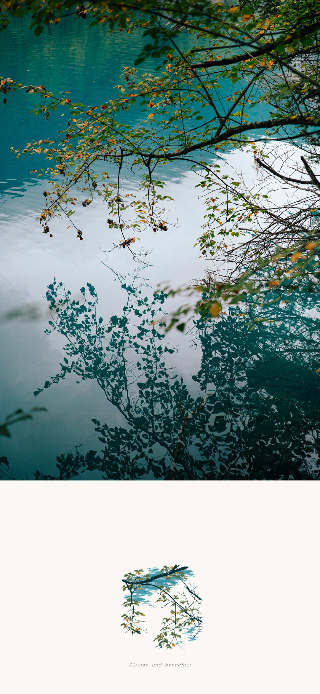
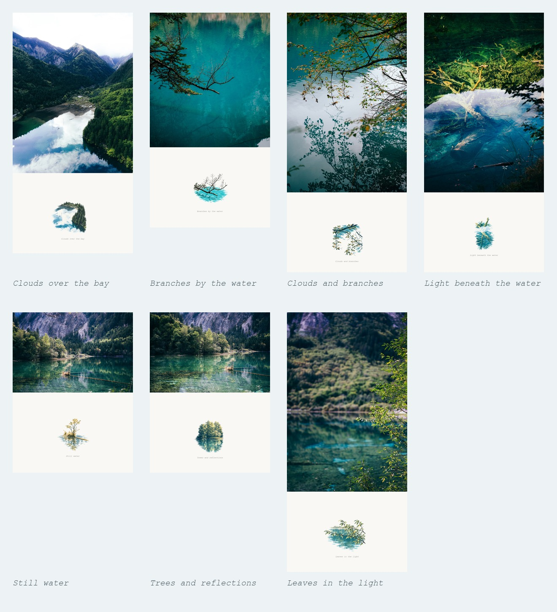

<div align="center">

# Photo Echo · 照片回声

**保留整张照片，用一块精巧小景留下回声。**

完整原图 · 自由比例 · 英文配文 · 批量静态导出

[看效果](#看效果) · [怎么用](#怎么用) · [调整已有作品](#调整已有作品) · [安装](#安装)

</div>

Photo Echo 是一个可直接调用的 skill。给一张或一批照片，Agent负责选择有特点的连续局部、制作插画、本机排版和集中导出；不需要另做EXE、启动Windows工作台或让用户手填任务配置。

默认成品是静态手帐：原照片完整保留，下方是少色印刷感小景和可选英文配文。已有插画或一批Live成果可以直接复用，调整比例、插画大小、留白和配文时不重新生图。

## 看效果

<p align="center"></p>

<p align="center"><em>Clouds and branches · 完整原图在上，小景在下</em></p>

这是仓库已有照片和已有插画的重新排版，未再次生图。照片不再塞进固定的横向窗口；画布跟随原图比例，纸面高度可调。

<p align="center"></p>

| 小景 | 静态成品 |
| --- | --- |
| 云影湖湾 | [完整原图手帐](assets/examples/01-cloud-bay/handbook.png) |
| 枝端入水 | [完整原图手帐](assets/examples/02-branch-water/handbook.png) |
| 云影与枝框 | [完整原图手帐](assets/examples/03-cloud-branch/handbook.png) |
| 沉木水光 | [完整原图手帐](assets/examples/04-submerged-wood/handbook.png) |
| 植物小岛 | [完整原图手帐](assets/examples/05-island/handbook.png) |
| 亮树与倒影 | [完整原图手帐](assets/examples/06-tree-reflection/handbook.png) |
| 叶端与湖光 | [完整原图手帐](assets/examples/07-leaf-light/handbook.png) |

这七张示例都使用本仓库此前已有的公开素材。新的静态样例完整显示公开原图，配文为英文；原稿和早期动画演示保留。素材许可见 [assets/README.md](assets/README.md)。

### 原照片和插画参考是两件事

| 完整原照片 | 只供插画使用的局部参考 |
| :---: | :---: |
|  |  |

原照片完整进入手帐；只将有特点的连续局部供给生图工具。保留小树与水线、横枝与倒影、建筑与相邻空间等关系，不把景物拆成物件目录，也不把整幅风景缩小重画。

## 当前效果与功能

| 功能 | 默认行为 |
| --- | --- |
| 原照片 | EXIF转正，完整保留四边，等比缩放 |
| 画布比例 | 根据横图、竖图、方图、全景和插画区高度自动决定 |
| 留白与插画 | 少色印刷感、细断线、克制大小；纸面高度和插画大小可调 |
| 配文 | 可选的一行英文，也可留空 |
| 导出 | 默认PNG，可选JPG、完整手帐、单独插画或两者 |
| 批量 | 所选照片集中到一个目录，按原文件名对应 |
| 已有作品 | 复用现有插画，单张／批量调整并追加新版本 |
| ZIP | 可选，只包含本次选择的成品，排除内部缓存与源图 |
| 动态 | 用户需要时另选本机微动、原Live和Apple资源 |

比例、语言和样式默认值可被用户的明确要求替换。显式指定画布宽高时也完整适配照片；历史裁切版式只在明确选择时使用。详细规则见 [SKILL.md](SKILL.md) 和 [比例与审美](references/layout-and-style.md)。

## 怎么用

给Codex照片或路径，直接说：

```text
使用 $photo-echo，把这批照片做成手帐。
保留完整原图，自由比例，配文用英文，只导出静态图片，全部放在一起。
```

不用准备选区、插画、蒙版、模型参数或任务JSON。没有指定保存位置时，在第一张原图旁创建 `Photo Echo` 文件夹；附件没有本地原目录时放在当前工作区。

```text
Photo Echo/
├── 湖湾_手帐.png
├── 树影_手帐.png
└── .photo-echo/       内部素材与逐张设置
```

选择JPG或单独插画时按相应名称导出。默认不生成视频、GIF或Apple文件。静态排版只依赖本机图像库，已有插画调整不需要AI连接、视频编码器或账号登录。

## 调整已有作品

```text
使用 $photo-echo，复用这批已经生成的插画重新排版。
原图不要裁剪，插画区更矮一些，只处理选中的几张，仍然导出PNG。
```

Agent先读取已有源图、插画和各张设置，再在本机合成。没有要求更改的配文、大小和留白继续逐张保留；旧图不覆盖，新版本自动加序号。

新版本保存了原照片与插画快照，即使原输入移走，也可调整。其他软件的项目或既有Live成果也可使用：Agent根据保存的源图与插画对应关系准备批量映射，不要求转换成桌面应用。

<details>
<summary>本机助手命令（由Agent内部准备和执行）</summary>

```sh
python -m pip install -r requirements.txt
python scripts/photo_echo.py batch --jobs assets/examples/jobs.json --out "Photo Echo"
python scripts/photo_echo.py recompose --from-output "Photo Echo" --paper-ratio 0.45
python scripts/photo_echo.py recompose --from-output "Photo Echo" --select 03-cloud-branch.jpg --image-format jpg --zip
```

默认是完整原图的静态PNG。`--image-kind illustration` 导出单独插画，`--image-kind both` 导出两种图片，`--scale` 调整大小，`--caption` 调整英文配文。每个batch任务可带独立参数；只有明确提供的全局参数才应用到整批。

只在用户需要动态时增加 `--video`；Apple资源用 `--apple`。视频另需FFmpeg，原Live另需ffprobe，Apple封装另需Live Photo Box和ExifTool。静态模式忽略旧运动计划，也不探测原Live视频。

</details>

## 安装

将本仓库放在Codex的skills目录，目录名保持 `photo-echo`。安装后刷新技能列表或重新打开会话。

**Windows PowerShell**

```powershell
git clone https://github.com/Michaeloan/photo-echo-skill.git "$env:USERPROFILE/.codex/skills/photo-echo"
```

**macOS／Linux**

```sh
git clone https://github.com/Michaeloan/photo-echo-skill.git "$HOME/.codex/skills/photo-echo"
```

已有安装在该目录运行 `git pull --ff-only` 即可。自定义CODEX_HOME时使用其skills目录。本仓库提供skill、跨平台本机脚本和示例，不包含Windows工作台或EXE。

## 可选动画

<details>
<summary>本机微动、原Live与历史动态演示</summary>

当前脚本支持局部叶端轻摆和连续水纹，纸面、文字和主要结构固定。静态输入的照片区静止；确认配对的原Live保留原动作、时长和可用音轨，完整适配照片区域。

[早期七张动画总览](assets/gallery.mp4) 和 [动态对比](assets/motion-comparison.mp4) 保留用于观察运动效果；这些历史演示使用当时的固定版式，不代表当前默认原图展示范围。新版默认不输出动画。

本机微动不重建真实动作。用户明确要求其他方案时可评估并集成，默认流程不擅自增加外部付费服务。见 [动态资源说明](references/live-export.md) 与 [方案参考](references/natural-motion.md)。Apple电脑元数据检查与iPhone实测分别记录，不把普通MP4当作完整Apple实况。

</details>

## 验证与许可

本机测试覆盖完整原图、自由比例、英文配文、静态默认、PNG/JPG、透明插画、批量与选择子集、已有素材复用、输入移走后的恢复、独立逐张设置、ZIP、不覆盖旧图，以及可选原Live完整画面与音轨。测试和示例重新排版均不调用生图服务。

代码和文档使用 [MIT License](LICENSE)，示例素材按 [素材说明](assets/README.md) 使用；外部工具不随仓库打包。方法来源见 [sources.md](references/sources.md)。
